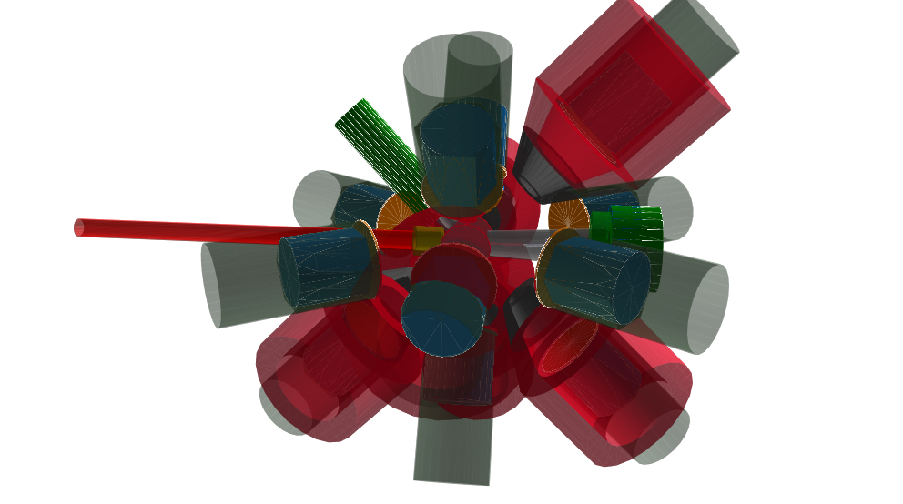

# G4Horus

[](https://doi.org/10.5281/zenodo.3692474)
[](https://travis-ci.org/janmayer/G4Horus)
[](https://www.codacy.com/manual/janmayer/G4Horus)

An implementation of the HORUS High-Purity Germanium (HPGe) γ-ray spectrometer and associated equipment in Geant4.



## Overview

The main goal of this project is to provide an accurate, easy-to-use efficiency simulation for the HORUS setup at the Institute for Nuclear Physics, University of Cologne.

Components:

- Geometries
    - Target Chambers
        - Astro Target Chamber
        - Astro Target Chamber V2
        - SONIC
        - SONIC V3
        - SONIC V3 ΔEE
    - Setups (HPGe Arrays with positions for HPGe Detectors)
        - HORUS (14)
        - Cologne Clover Counting Setup (2)
    - Detectors
        - High-Purity Germanium (HPGe)*
            - Coaxial (default)
            - Clover
            - Encapsulated Hexagonal
        - Bismuth Germanate (BGO) anti-Compton shields
        - (WIP) Passivated Implanted Planar Silicon (PIPS)
    - Auxiliary equipment
        - γ-Filter-Disks
        - (NYI) Passive γ-Supershields
- Actions
    - Event Generators
        - Particle Gun
        - (WIP) Scattering Gun
        - (NYI) Coincidence Gun
    - Output Formats
        - ROOT Histograms
        - ROOT Ntuples (not recommended)
        - SOCOv2 Events
    - Evaluation
        - Visualization Mode
        - Batch processing Mode
        - Automated efficiency evaluation

\*) Note that each HPGe detector has unique properties, stored in the `DetectorLibrary`, and is referenced by its manufactured ID.

## Getting Started

### Dependencies

- A not horribly outdated C++ build environment (`cmake` >= 3.11, `gcc` with C++11 support)
- [Geant4](https://github.com/Geant4/geant4) >= 10.5 (make sure the proper environment variables are set, see example in `G4Horus.sh`)
- [Assimp](https://www.assimp.org/) to load binary stl files. Should be available in your package manager. Note: CADMesh is bundled and does not need to be installed separately anymore.

### Installation

```sh
git clone https://gitlab.ikp.uni-koeln.de/jmayer/g4horus.git
cd g4horus
./G4Horus.sh
```

The project should compile and open a visual interface with a default view should open.

### Quick Simulation

- Run `./G4Batch.sh scripts/doit.mac` or other macro files to run the actual simulation.
- Use `./efficiency.sh` to automatically extract efficiencies from the simulated data.

## Constructing the Setup

The experimental setup is assembled in `src/DetectorConstruction.cc`. Change the target chamber, detectors, and sensitive volumes here.
Use `./G4Horus.sh` to check your setup.

Example for equipping HORUS with detectors:

```C++
auto horus = new Horus(worldLV);
// ID, Position, Distance (to endcap or filters on endcap), Filters
// BGO Type, Position, Distance (to BGO or filters on bgo), BGO-Filters
horus->PlaceDetector("73954", "Ge00", 20. * cm);
horus->PlaceDetector(BGO::tSMALLNOSE, "BGO00", 10. * cm, {{"G4_Cu", 2. * mm}});
```

and the sensitive volumes (WIP):

```C++
extern const std::vector<std::string> detectors = {"Ge00", "BGO00"};
```

Note that without setting the sensitive detector, no output will be recorded.

The output type is set in `G4Batch.sh`, e.g. `-k hist` for histograms and `-k soco` for SOCOv2 events.
